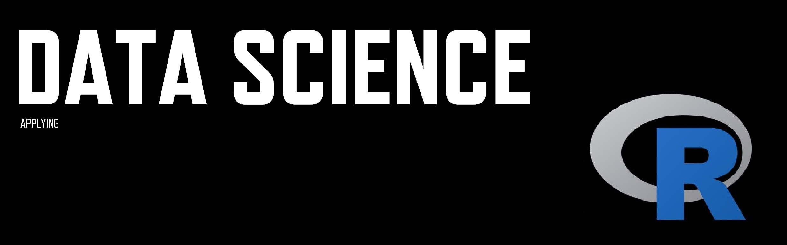

 

  

# Portifolio_R
Meu portfólio com projetos em R realizados no:
- curso Data Science Analytics (Adriana Silva)

## V Nakano
Auditora Federal de Controle Externo e Cientista de Dados em formação.

Background in: Engenharia, Gestão pela Qualidade Total, Auditoria.

## Links:

LinkedIn: https://www.linkedin.com/in/val%C3%A9ria-n-13030747/

Medium

## Projetos:

Como ...: 
